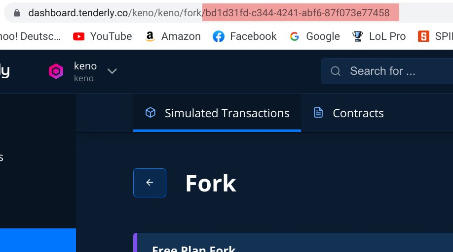
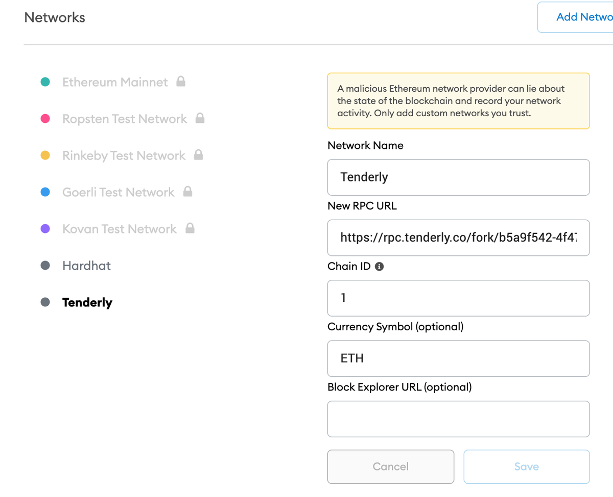
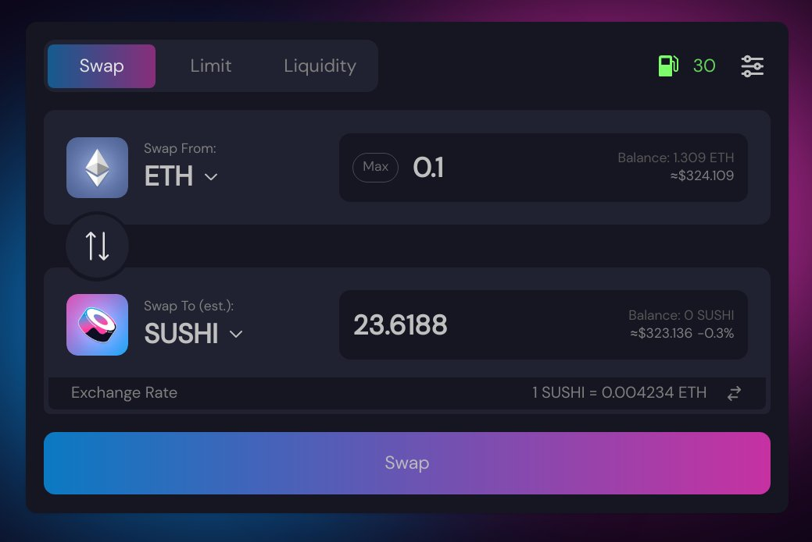
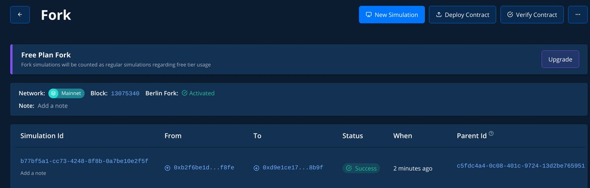
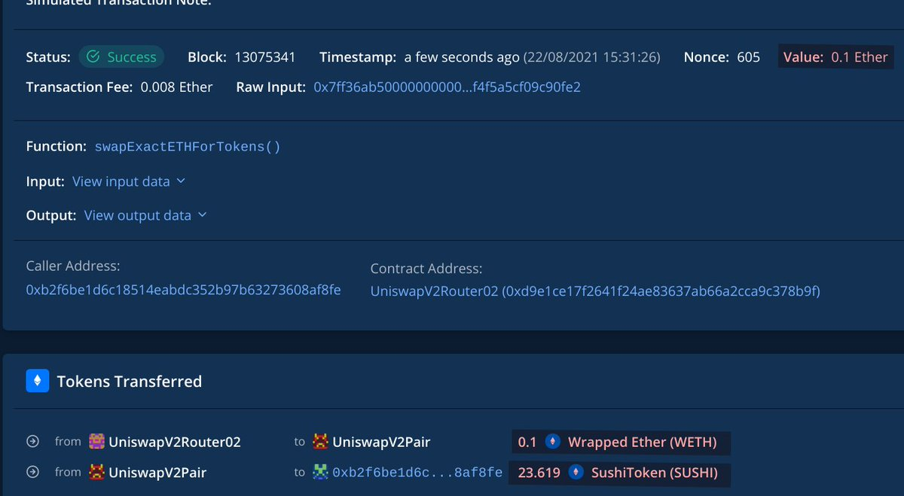

Keno 🦇🔊 ([@0xKeno](https://twitter.com/0xKeno))

# 1

Today I want to talk about a cool way to test out dApps without spending any funds. HardHat node is amazing for mainnet forking but for end users a bit complicated. 

[@TenderlyApp](https://twitter.com/TenderlyApp) offers a forking service with a RPC endpoint, all configurable through UI.

# 2

You can sign up for free and it offers a bunch more super cool features.

Here is how it works:

1. Sign-up on [tenderly.co](http://tenderly.co) 

2. Click on Forks and create a new fork

3. Click on Mainnet

4. Copy the Fork ID (marked red in this picture) [pic.twitter.com/5j4s5ANew0](https://twitter.com/0xKeno/status/1429438140750643208/photo/1)

5. Take the Fork ID from step 4. and now go to the MetaMask custom RPC page. Add the mainnet fork by using the URL in the format [rpc.tenderly.co/fork/](https://rpc.tenderly.co/fork/){forkID}. [pic.twitter.com/1CsXn8xQ5U](https://twitter.com/0xKeno/status/1429438147360968708/photo/1)

# 3

What this allows you to is to play around with live versions of dApps and see the effects. Whether you want to learn more about an application.

(Maybe try swapping and lending on [sushi.com](http://sushi.com) ;) ) or to try out whether an interface really does what it claims to do and doesn't simply steal your funds. 

To get full usage out of this cool tool we should have a look at a transaction we have made on this fork:

I want to buy some delicious [$SUSHI](https://twitter.com/search?q=%24SUSHI) and clicked on swap on the main SUSHI UI. [pic.twitter.com/HHz2fuuc5j](https://twitter.com/0xKeno/status/1429438155464261637/photo/1)

After a few seconds, the transaction is completed. I now head back to the Tenderly Dashboard ([dashboard.tenderly.co](https://dashboard.tenderly.co/)) and have a look at the transaction I just made by clicking on the fork I created. 

It shows me the transaction I just made: [pic.twitter.com/2MvDVqxmS1](https://twitter.com/0xKeno/status/1429438160673677312/photo/1)

By clicking on the transaction I get a more detailed view that shows me everything that happened. One quick check is to look at where ERC20 transfers go to. [pic.twitter.com/9kOpl8Bs6H](https://twitter.com/0xKeno/status/1429438166340194311/photo/1)

In this case, it is easy to see that the SUSHI I wanted was received on my address, while the appropriate ETH left my wallet. Everything is gucci with this transaction.

# 4

This feature is also super useful for UX testing as one can give out the RPC to testers and look at any failed TX in one Dashboard. More information here in their docs. https://www.notion.so/Tenderly-Forks-060a6c268af04356b437135406b0151d and https://blog.tenderly.co/how-to-debug-solidity-smart-contracts-with-tenderly-and-truffle/

Happy to answer any questions, hope this help anyone. :) Have a good day everyone.
