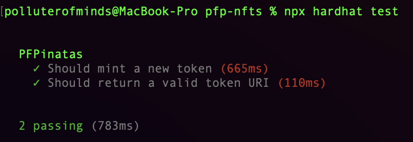
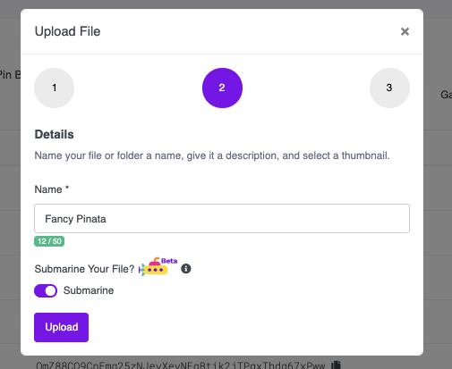
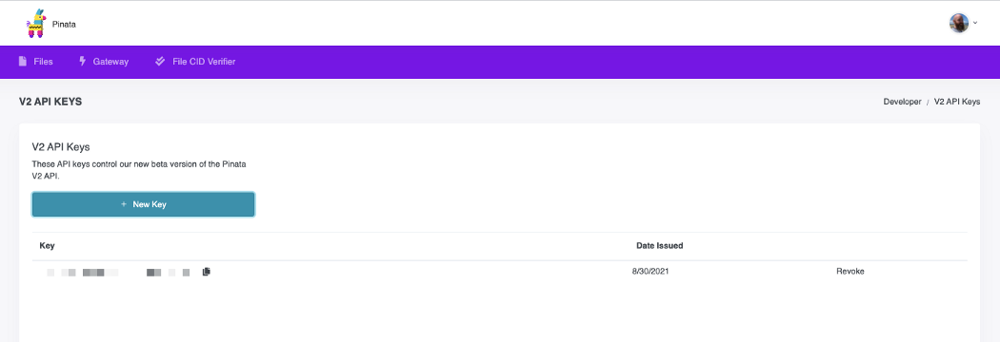
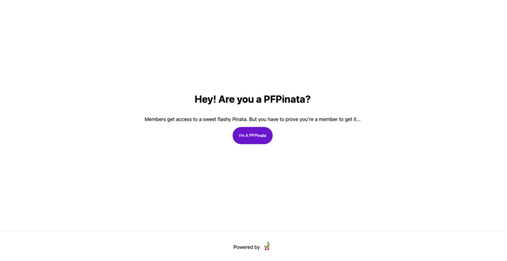
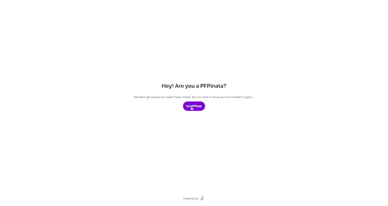
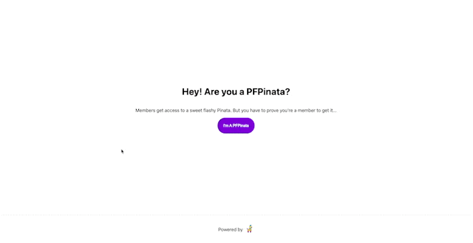

> medium-to-markdown@0.0.3 convert
> node index.js "https://medium.com/pinata/how-to-manage-nft-visibility-18e9b7a76b8c"

How To Manage NFT Visibility
============================

Using Pinata Submarine, Hardhat, and Ethers.js
----------------------------------------------

[

](https://polluterofminds.medium.com/?source=post_page-----18e9b7a76b8c--------------------------------)[Justin Hunter](https://polluterofminds.medium.com/?source=post_page-----18e9b7a76b8c--------------------------------)Follow[Sep 2](https://medium.com/pinata/how-to-manage-nft-visibility-18e9b7a76b8c?source=post_page-----18e9b7a76b8c--------------------------------) · 16 min read


NFTs aren’t just digital pieces of art. They are [layered mechanisms](https://medium.com/pinata/what-is-an-nft-2241d4c0a060) for proving ownership, access, rights, and more. NFT avatars (sometimes knows as PFP—[ProFile Picture](https://twitter.com/paulcowgill/status/1425831453317902337)) have been one of the most popular use cases for NFTs. You can see this with CryptoPunks, Bored Ape Yacht Club (BAYC), and more. But the reason they are popular doesn’t end with the profile picture you get access to. These PFP NFTs are membership tokens more than anything else.

Owners of BAYC tokens can update their profile pictures, sure. But they also get exclusive members-only access to content, [Discord channels](https://collab.land/), [web pages](https://boredapeyachtclub.com/#/login-bathroom), and more. The same is true of CryptoPunks and dozens of other PFP projects. This is one of the more interesting use cases for NFTs. The profile avatar portion of this is a fun add-on, but the real reason to own the tokens is exclusive access to other content.

Today, we are going to build a page that is only accessible to members who own a particular NFT. Members will be able to access the page, token ownership will be verified, and they will be able to view a special image that only members have access to. As a verification layer on top, the image will be served using an IPFS CID while remaining private. Members can download the image and easily verify the CID and authenticity.

Let’s get started!

Setting Up
----------

We’re going to use our own ERC721 contract to mint our tokens. We’re doing this because we want to sell the NFTs on the release date through our own site. Randomization is important, and we can only control that if we mint each token at time of purchase.

So, with that in mind, we’re going to need a few things:

*   Node.js installed > v12
*   [A Professional Plan account on Pinata](https://pinata.cloud)
*   [Hardhat installed](https://hardhat.org/)
*   Code editor
*   A folder of randomized files that will act as your NFTs

A quick note, most PFP NFT projects use some sort of generative algorithm to create attributes for their NFTs, and some even use an algorithm to create the media files. Such a script is outside the scope of this tutorial. Instead, I am going to create a folder of random Pinatas. I will write a very basic script that determines which Pinata is associated with which token ID.

Ready to start?

Creating the Contract
---------------------

I always like to start with the smart contract. It’s the easiest to mess up, and it’s the most impactful to your project if you do mess it up. Fortunately, we won’t be modifying much from a standard ERC721 contract.

[In a previous post](https://medium.com/pinata/how-to-create-layer-2-nfts-with-polygon-and-ipfs-aef998ff8ef2), you saw how to add back in the old `setTokenUri` method that used to appear on all ERC721 contracts. In this post, we’re going to leverage the `baseUri` variable on the contract and we will set that URI when we deploy our contract.

Let’s get started by creating a folder to house all of our contract and script work.

```
mkdir pfp-nfts
```

Change into that directory and run:

```
npm init -y
```

Now, we need to install hardhat to help us with our solidity development and deployment. You can install that like this:

```
npm install -D hardhat
```

The `-D` just tells `npm` that this will be a development dependency. If any part of our project needed to be built for production, development dependencies wouldn’t be included.

To help us get up and running with hardhat quicker, they provide a quickstart with a sample project as a guide. To initiate that, run:

```
npx hardhat
```

Select `basic sample project` and just hit enter through the other questions.

If you open the project folder up in your favorite code editor, you’ll see that our sample project includes a very simple smart contract called `Greeter.sol`. This is found in the `contracts` folder. We’re not going to use that contract, but feel free to take a look at it to understand what was generated by hardhat.

Back at the command line, we’re going to install [OpenZeppelin](https://openzeppelin.com/) and grab one of their pre-built and audited contracts.

```
npm install @openzeppelin/contracts
```

With that installed, let’s update our `Greeter.sol` contract. I’m going to change the name of the contract to `PFPinatas.sol` but you can change the name to whatever makes sense for you. Once you’ve made that change, we’re going to replace the contents of the contract with the [example OpenZeppelin provides here](https://docs.openzeppelin.com/contracts/4.x/erc721).

Your file should look like this now:

We’re, of course, not going to keep this. We need to modify a bit to handle our use case. The changes we are going to make are as follows:

*   Change the token name
*   Initialize a baseURI variable when the contract is deployed
*   Override the `tokenURI` method included in the ERC721 contract

That sounds like a lot, but it’s really not. In fact, our updates only add 5 lines to the entire contract. It’s such a small update that I’m going to suggest you just replace the entire file:

In these updates, we have stopped using the `ERC721URIStorage` utility. I very much like that OpenZeppelin has started using that in their example, but for the sake of our PFP tutorial, we really do want to use the `baseURI` concept.

Why?

Most PFP projects are working with thousands of files that will become NFTs. You don’t want to have to write a script to upload individual files to the storage provider of your choice when you can upload a single folder. That single folder’s location becomes the baseURI.

We added in a new utility from the `Strings` contract. This is because we are overriding the `tokenURI` method and needed to make use of the `toString()` function. Speaking of which, we modified the base `tokenURI` method because we want to return the `baseURI` with the `tokenId` concatenated. The `baseURI` is being set when the contract is deployed. You can see that in the contract’s constructor.

Ok, we have a 31-line smart contract. Not bad at all. Let’s test this thing to make sure it works.

Testing the Contract
--------------------

You should already have a `test` folder that was created when the sample project from hardhat was generated. Inside that folder, there is a file called `sample-test.js`. Our first step is to rename the file. Name it something that makes sense for your test. I’m going to just go with `pfpinata-test.js`.

Once you’ve changed the name, take a look at the way tests work. Explore the existing file. Get to know it. Learn to love it. Then destroy it all!

Seriously, though. We’re going to replace the entire file contents with this:

As you can see in my example, I only have two tests. I wanted to test that minting worked and that the correct `tokenURI` was returned considering that was something we added an override for in our contract. In reality, you should probably write tests for everything. There are probably some pre-written tests for the ERC721 OpenZeppelin contract you can dig up, but we’re not going to do that here.

To run these tests, return to your command line and enter:

```
npx hardhat test
```

You should see an output like this:



I’m feeling pretty confident with our contract, how about you? Let’s figure out how to deploy this to testnet (sorry, folks I don’t have the cash lying around to deploy mainnet contracts for tutorials). Once it’s deployed on testnet, we’ll write a script to mint some tokens to a few different wallet addresses, and then, we can get into the fun of submarining with Pinata.

Deploying the Contract
----------------------

In order to deploy our contract to testnet, we need to do three things:

1.  Choose which Ethereum testnet to deploy to
2.  Make sure we have testnet ETH for that particular testnet
3.  Update our config file

For the sake of this tutorial, we are going to be using the Rinkeby testnet. So #1 is complete. In order to get testnet ETH for Rinkeby, [you can visit the faucet here](https://faucet.rinkeby.io/). When you have that, #2 is complete. On to #3.

Before we move forward, you’ll need to decide how you want to deploy to a live network. There are many Ethereum node providers out there, so you can choose any provider you’d like. As per the Hardhat docs, [I’m going to use Alchemy](https://www.alchemy.com/). They have a nice free plan that will work well for us. If you are using a different provider, simply change the API Keys and the RPC URLs accordingly.

Back in your project directory, find the `hardhat.config.js` file. You can update it to look like this:

Again, if you are using a different node provider, replace the references to Alchemy with the proper variables from the providers you selected.

The `RINKEBY_PRIVATE_KEY` is the private key for your Rinkeby testnet wallet where you send funds from the faucet. It is very important that you protect this key. Include it as the variable in your config file, but make sure you do not check that file into a source control system like git.

That’s all the edits we need to make. Of course, when deploying to mainnet, you would follow these steps but with your variables updated to support mainnet instead of testnet.

Now, we just need a script to deploy our contact. Fortunately, we already have a scripts folder thanks to our Hardhat project scaffolding. Find the `scripts` folder and take a look at the `sample-script.js` file. Let’s rename this file to `deploy.js`. We are going to match the pattern in that existing file but update it for our actual contract. You can update your file to look like this:

But WAIT! Do you see that our `BASE_URI` variable is empty. We need that before we can deploy our contract.

Uploading Images
----------------

Let’s create another file in our `scripts` folder called `upload.js`.

In this script, we are going to do a few things. We’re going to generate the metadata for our NFTs, we’re going to upload a folder of images, and we’re going to upload a folder of metadata. If you remember, I am going to be creating NFTs from some pre-designed images. I’m only creating and minting 4 NFTs. The process will be similar for any number of assets you plan to mint. Remember, we are not covering generative algorithms in this post, so I’ll be keeping things simple.

When you name your image files, it’s important to give them names that will correspond to tokenId of minted tokens. In my case, I have just four images, so they would be `1.png, 2.png, 3.png, 4.png`. We need our images named like this because we are going to simplify the metadata creation process with those names. Trust me.

Before we begin, you’ll want to install Axios. It makes the process of making HTTP requests simpler. Since we’re going to be uploading a folder, we need to be able to walk through all the files in our folder to build the data that is posted to Pinata. That requires a couple of additional packages. You should be installing the following:

```
npm i axios base-path-converter recursive-fs
```

Now, in your `upload.js` file, let’s start by uploading our image files. To keep things as simple as possible, I recommend putting the images folder you plan to use inside of the project directory. Once you’ve done that, you’ll need to go get a JWT from Pinata. You can do that by signing in, going to the [Keys](https://app.pinata.cloud/keys) page, and generating a new key. Then, update your `upload.js` file to look like this:

If you run that script at the command line with `node scripts/upload.js` You should see (when it’s done) a printout that includes the CID for your folder.

Uploading Metadata
------------------

Now, we can create the metadata for our NFTs. You likely already have a method for doing this, but for the sake of completeness, I’m going to create a script that will generate metadata files for my four tokens. I’ll create that in its own file within the scripts folder, and I’ll call it `metadata.js`.

Because I’m going to be generating random data, I’m going to use a library called faker. That can be installed like this:

```
npm i faker
```

Create a metadata folder at the root of your project directory, and then in your `metadata.json` file add this code:

This will create a metadata object for each of your NFTs. Again, you will surely be generating your metadata some other way than using a library like faker, but this illustrates how you might want to go about doing it through a script. At the end of the day, my script above was just to make sure I had a folder of metadata I could then upload to Pinata.

Now, let’s use the same `upload.js` script we used before. Modify the `path` variable to point to your metadata folder. So for me, that is simply changing `./pinatas` to `./metadata`. Once you’ve done that, run your upload script with:

```
node scripts/upload.js
```

If you’re creating a project with thousands of files, this upload could take a while. But guess what you’re going to get back when it’s done? That’s right—it’s the CID for your smart contract’s `baseURI`.

The full URI should look like this: `YOUR_CUSTOM_GATEWAY_URL/ipfs/METADAT_FOLDER_CID`

With that URI in hand, I think it’s time to deploy our contract to testnet.

Really Deploying The Contract Now
---------------------------------

We previously set up our `hardhat.config.js` file with the proper keys (wallet and Ethereum node) so that we could deploy to the rinkeby testnet. Now, we just need to update our deploy script to use the `baseURI` we just created.

To deploy, go back into your `scripts/deploy.js` file and update the baseURI variable with the baseURI we constructed above. Then, run this command:

```
npx hardat run scripts/deploy.js --network rinkeby
```

If all goes well, you’ll see the contract address printed at the command line. Congratulations! You’ve come a long way. But we’re not done yet. Save that contract address because we will need it for this next part.

Before we move on, let’s make things easy on ourselves for testing and mint an NFT from our new contract into our wallet. Create one more file in the `script` folder and call it `mint.js`. The file should look like this:

You can run this with the following command:

```
npx hardhat run scripts/mint.js --network rinkeby
```

These last two scripts are the most common places you might hit some trouble, so I’ve put a little troubleshooting guide together here:

One final thing we can do now is check that our wallet holds the NFT as we expect it to. Let’s create a small script to check the owner of a token ID.

Run the script with:

```
npx hardhat run scripts/getOwner.js --network rinkeby
```

This should print out your Rinkeby wallet address.

Serving Protected Content Based on NFT Ownership
------------------------------------------------

Now that we have deployed our contract and minted it, we are going to create some “members-only” content that will be accessible to those that own an NFT from our contract. To do this, I’m going to create a simple Next.js app so that we have client and server functionality. Here’s a high level summary:

*   React app that uses Metamask for authentication and transaction signing
*   Backend that verifies signed message
*   Backend that checks if token is owned by address
*   Serve content if it is owned
*   Reject if not

This is where Pinata’s new Submarining functionality really shines. Let’s create our Next.js app, and then we’ll get into the details. From the command line in the root of your project, run:

```
npx create-next-app pfp-client
```

This will create a new Next.js project inside your existing directory. Change into that directory with `cd pfp-client`. I’m going to keep this simple and rely on Metamask and the injected `window.ethereum` object on the client-side. But on the server, we need `ethers.js` and a helper library called `ethereumjs-util`. Since we are going to need to post data to our backend server, let’s also install `axios`.

```
npm i ethers ethereumjs-util axios
```

Once all that is installed, let’s take a break from code for a couple of minutes, and let’s submarine some content on Pinata!

**Submarining on Pinata**

Go to your Pinata account. Remember, you have to be on the Professional Plan to access submarining. Once there, go to the file manager page. Click Upload, then choose File. You’ll be walked through the upload process. On Step 2, make sure to toggle on the submarine option.



I am going to be submarining an awesome (**epilepsy warning: flashing images and bright colors**) Pinata gif. You can choose something more practical, but for the sake of this tutorial, I’m keeping it simple. When you finish the upload, you’ll see a CID in the interface. Copy that and save it somewhere. We’ll need it soon.

Once the file is uploaded, you’ll need to go generate an API key. Submarining is a beta feature of our new infrastructure. Click the avatar menu dropdown in the top-right, then click V2 API Keys. Once there, generate a new key. Copy that key and save it somewhere because we’re about to get back to coding.



**Coding Our Gated Content Site**

Before we start, let’s find in our root project directory the `artifacts` folder. In that, you should see a `contracts` folder. Inside that folder, you should have a folder called `PFPinatas.sol`. Copy the `PFPinatas.json` from within that folder. Paste it into the root of your `pfp-client` folder. We’re doing this because we need access to the contract ABI.

Now, from the default Next.js setup in our `pfp-client` folder, we are only going to edit two existing files. I’m trying to keep this example as minimal as possible. In Next.js, our server-side code is housed under the `pages/api` folder. The React app is in our `pages.index.js` file. We are going to update `pages/api/hello.js` and `pages/index.js`. Simple, right?

First thing you want to do is update the `pages/api/hello.js` to be names `pages/api/verify.js` . Now, let’s update our `pages/index.js` file. We’re going to keep all our React code in a single file, but you can refactor this however you see fit. Here’s the code (don’t worry, we’ll walk through it all).

I mentioned this earlier, but again, we are using the `window.ethereum` object injected by Metamask. That’s the first thing we check for and set as a state variable. We also make sure to request the user’s Ethereum account immediately. This forces an unlock of Metamask if it is masked. We also have a state variable for the secret URL to the piece of content we want members to be able to access. The server will provide this if you own the NFT. The final state variable is `isPFPinata`. This is an indicator to update the UI.

We then have a function called `handleProveIt`. This function will sign a message. The user will be prompted to sign it. Once signed, the signature data is then sent to the server. The server is where this message will be verified. Assuming the user has properly signed and the user owns the NFT, the server will respond with a URL with an access token for the gated content. Otherwise, the server will throw a `401` error. We set the `isPFPinata` variable accordingly.

The rest of the code is just UI with a button to trigger the `handleProveIt` function. I did a little styling and added the Pinata logo and favicon. Here’s what my page looks like:



Now, this won’t do anything yet. We need to wire up our server code to handle the request. Let’s do that now. Head over to your `pages/api/verify.js` file and add the following:

This file looks daunting, and it is. But such is the nature of verifying signed messages. We are making use of the `ethereumjs-util` library to help us verify the signed message. If the signature is valid, we will get back the wallet address that matches the `address` parameter in our account body.

If that happens, we know we can now check to see if that address owns the NFT in question. To check on this, we need to make a request against our smart contract. We’re using the `ethers.js` library for this. To instantiate our contract object, we need our contract ABI, thus why we copied the `PFPinata.json` file into our client code directory.

We need to call the `balanceOf` method on our contract with the wallet address provided to verify if that address owns one of the NFTs. If they do, the response will be a number greater than 0. So, we check for that. If the address owns one of the NFTs, we make a request to Pinata’s API for an access token and then return that token appended to a URL that is made up of our custom dedicated gateway URL and the CID for the gated content that we submarined with Pinata. Otherwise, we return a 401 error.

Whhheeeeew. That’s a lot.

Look the code over a few times. Take it all in. Then implement it. It’s a lot, but it’s necessary to verify signature data.

A quick note on hard-coded variables: a lot of the server-side variables should be env variables. That’s outside the scope of this tutorial, but Next.js has a great env process.

OK, let’s run the app. In your command line, run:

```
npm run dev
```

This should load up our gated content page. You will likely be prompted the first time to unlock Metamask and provide your account address. Try clicking the button on the page. If the account you’re using owns one of the NFTs we created, you should see the gated content displayed on the screen:


SUCCESS EXAMPLE HERE

But what happens if you don’t own the NFT? Remember that placeholder for a funny gif? This is where the gif gets to shine. Here’s mine:


If you’re interested in the full source code for this tutorial, [it’s located here](https://github.com/polluterofminds/nft-gated-content). I did not set environment variables, so you’ll need to do that or just update the placeholder variables in the code.

Wrapping Up
-----------

This was a long post, but I hope it got you excited. I hope your creative juices are flowing. How can you leverage this with your NFT projects? What cool things can you build?

Pinata Submarining opens up a whole new world of functionality to the NFT space. Happy submarining!
